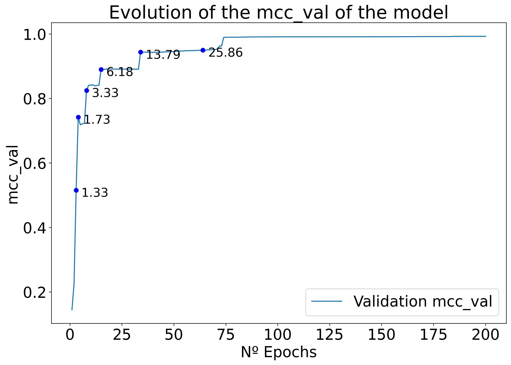
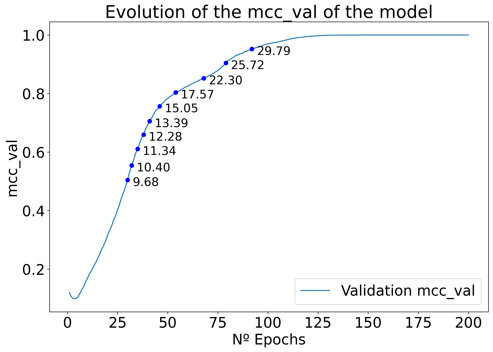
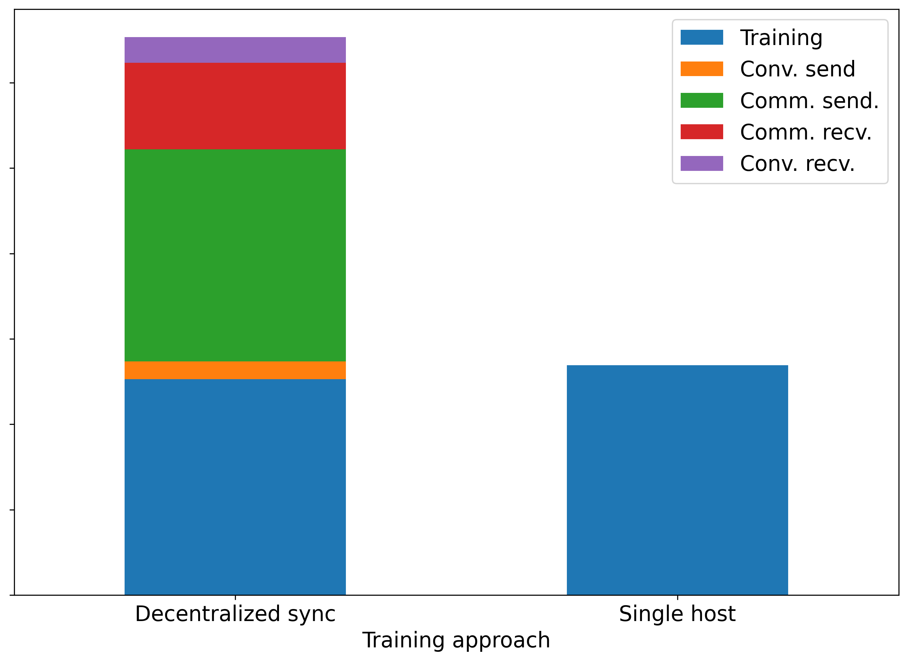
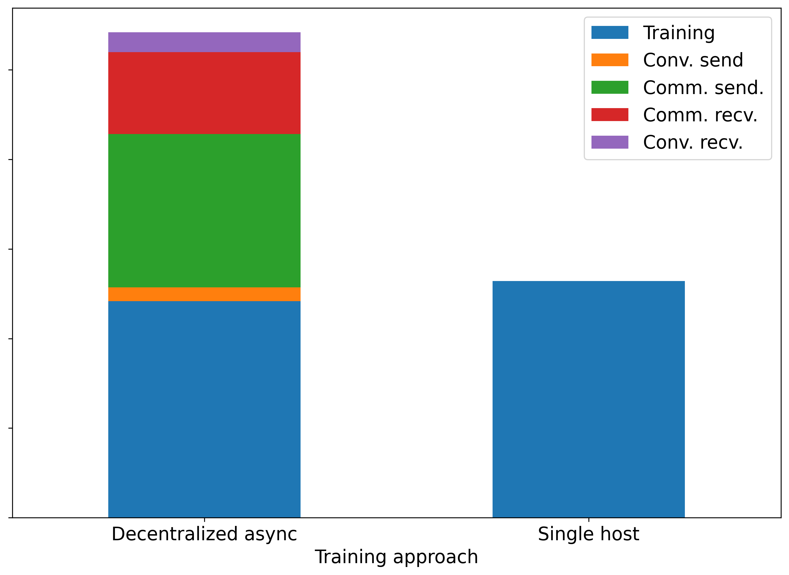

# FL - Costs - Extended

## Structure

This repository has the following structure:
```
├── FL/
├── [DATASET]/
├── config.py
├── data_division.py
├── federated_learning.py
├── model_eval.py
├── single_training.py
├── plot_history.py
├── get_messages.py
└── Util.py
```

Other folders contain data and results for specific datasets, which have the following structure:
```
├── data/
├── fl/
├── models/
└── [DATASET].py
```

For the main structure:
- FL/ contains the implementation of the federated learning algorithms, which are used in federated_learning.py. 
- config.py defines the datasets and xai methods to be used in the experiments.
- Util.py contains a class which all datasets must inherit from.
- The other files are used to run experiments, use --help to see the options.

For the dataset structure:
- data/ contains the data files, including the train, test, validation and specific workers' data.
- fl/ contains the results of the federated learning algorithms, including the models and the training logs, for each experiment.
- models/ contains the models to be used in XAI algorithms.
- [DATASET].py contains the implementation of the dataset, including the data loading and the data division.

## Setup

First, create a virtual environment and install the requirements:
```
python3 -m venv venv
source venv/bin/activate
pip install -r requirements.txt
```

Download the datasets and put them in the data/ folder of each dataset (links found in the data/README.md files of each dataset).

Finally, run the data_processing.py and data_division.py files for each dataset, to process the data and divide it into train, test, validation and workers' data.

## Running the experiments

- Run single_training.py for each dataset
- Run federated_learning.py for the experiments you want to run

## Results

### Baseline training (Single host training)

#### IOT_DNL




#### Slicing5G




### Federated Learning (8 Workers)

#### IOT_DNL

##### Training time (Min)

|Performance (MCC) | Cent. Async. | Cent. Sync | Decent. Async. | Decent. Sync |
|---|---|---| ---- | ---- |
|0.50 | --    | 6.06    | --    | -- |
|0.55 | --    | --      | --    | -- |
|0.60 | --    | --      | --    | -- |
|0.65 | --    | --      | --    | -- |
|0.70 | --    | 8.07    | 0.68  | 0.82 |
|0.75 | --    | 16.11   | 1.06  | --   |
|0.80 | 6.58  | 18.13   | 1.28  | 1.49 |
|0.85 | 13.17 | 32.26   | 1.84  | 2.50 |
|0.90 | 39.57 | 70.44   | 4.00  | 5.92 |
|0.95 | 85.69 | 139.14  | 8.55  | 12.80|

##### Communication overhead (MB)

|Performance (MCC) | Cent. Async. | Cent. Sync | Decent. Async. | Decent. Sync |
|---|---|---| ---- | ---- |
0.50 |  --     | 788.17   |  --   |  -- |
0.55 |  --     |  --      |  --   |  -- |
0.60 |  --     |  --      |  --   |  -- |
0.65 |  --     |  --      |  --   |  -- |
0.70 |  --     | 1050.89  | 1.76  | 1.76 |
0.75 | 262.72  | 2101.78  | 3.51  | -- |
0.80 | 525.45  | 2364.51  | 4.39  | 3.51 |
0.85 | 525.45  | 4203.57  | 7.03  | 6.15 |
0.90 | 1576.34 | 9195.30  | 16.69 | 14.94 |
0.95 | 3415.40 | 18127.88 | 36.90 | 32.51 |

##### Epoch time distribution (log scale)




#### Slicing5G

##### Training time

|Performance (MCC) | Cent. Async. | Cent. Sync | Decent. Async. | Decent. Sync |
|---|---|---| ---- | ---- |
|0.50 | --    | 35.66  | 2.11 | 3.48 |
|0.55 | 20.26 | 39.23  | 2.35 | 3.71 |
|0.60 | --    | 41.64  | 2.58 | 4.17 |
|0.65 | 24.30 | 45.21  | 2.82 | 4.40 |
|0.70 | 28.34 | 48.77  | 3.05 | 4.86 |
|0.75 | 32.46 | 54.73  | 3.40 | 5.55 |
|0.80 | 36.53 | 64.29  | 3.87 | 6.26 |
|0.85 | 48.69 | 80.93  | 4.82 | 7.89 |
|0.90 | 56.80 | 95.17  | 5.77 | 9.74 |
|0.95 | 68.94 | 110.64 | 6.84 | 11.63 |

##### Communication overhead (MB)

|Performance (MCC) | Cent. Async. | Cent. Sync | Decent. Async. | Decent. Sync |
|---|---|---| ---- | ---- |
0.50 | --     | 845.59  | 1.54 | 1.45 |
0.55 | 140.93 | 930.14  | 1.74 | 1.54 |
0.60 | --     | 986.52  | 1.93 | 1.74 |
0.65 | 169.12 | 1071.07 | 2.12 | 1.83 |
0.70 | 197.3  | 1155.63 | 2.32 | 2.03 |
0.75 | 225.49 | 1296.56 | 2.61 | 2.32 |
0.80 | 253.68 | 1522.05 | 2.99 | 2.61 |
0.85 | 338.23 | 1916.66 | 3.76 | 3.28 |
0.90 | 394.61 | 2254.89 | 4.54 | 4.05 |
0.95 | 479.16 | 2621.31 | 5.41 | 4.83 |

##### Epoch time distribution (log scale)



## Authors

* **Rafael Teixeira** - [rgtzths](https://github.com/rgtzths)
* **Leonardo Almeida** - [leoalmPT](https://github.com/leoalmPT/)

## License

This project is licensed under the MIT License - see the [LICENSE](LICENSE) file for details